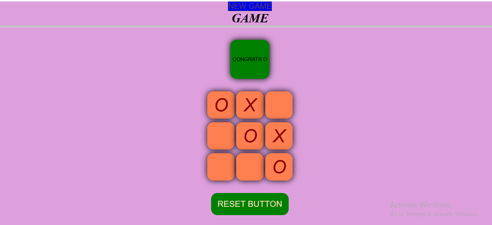

# Tik Tack Toe Game

A simple and fun **Tic Tac Toe** game built using **HTML, CSS, and JavaScript**.  
This game allows two players to play alternately (O and X) and displays a congratulatory message when someone wins.

---

## Features

- Two-player mode (O and X)
- Detects and announces the winner
- Reset and New Game buttons
- Colorful and responsive interface
- Simple and easy-to-understand JavaScript logic

---

## Technologies Used

- **HTML5** – for structure
- **CSS3** – for styling and layout
- **JavaScript (ES6)** – for game logic and interactivity

---

## How to Play

1. Click on any empty box to place your mark (O or X).
2. Players take turns until one wins or all boxes are filled.
3. When a player wins, a congratulatory message appears.
4. Click **Reset** or **New Game** to start again.

---

## Screenshot

---

## Live Demo

🔗 [Play Now](https://hifzasethi.github.io/tik-tack-toe/)  
_(Make sure GitHub Pages is enabled on the `main` branch.)_

---

## Author

**Hifza Sethi**  
Frontend Developer | BS Computer Science (7th Semester)  
📍 Peshawar, Pakistan  
 [GitHub Profile](https://github.com/HifzaSethi)

---

⭐ _If you like this project, don’t forget to give it a star on GitHub!_
